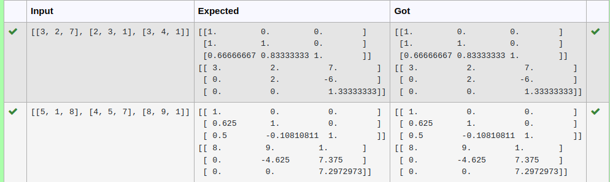
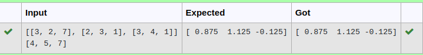

# LU Decomposition 

## AIM:
To write a program to find the LU Decomposition of a matrix.

## Equipments Required:
1. Hardware – PCs
2. Anaconda – Python 3.7 Installation / Moodle-Code Runner

## Algorithm
### Step 1:
Import numpy 
### Step 2:
From scipy package import lu()
### Step 3:
Get input from user and pass it as an array
### Step 4:
Get P, L U martix using lu()
### Step 5:
print L and U matrix
 

## Program:
(i) To find the L and U matrix
```python
#Program to find L and U matrix using LU decomposition
#Developed by: Sivabalan S
#Register number: 22004401
import numpy as np
from scipy.linalg import lu
a=eval(input())
P,L,U=lu(a)
print(L)
print(U)
```
(ii) To find the LU Decomposition of a matrix
```python
#Program to solve a matrix using LU decomposition
#Developed by: Sivabalan S
#Register number: 22004401
import numpy as np
from scipy.linalg import lu_factor,lu_solve
A =eval(input())
B =eval(input())
lu,piv=lu_factor(A)
x=lu_solve((lu,piv),B)
print(x)
```

## Output:




## Result:
Thus the program to find the LU Decomposition of a matrix is written and verified using python programming.

